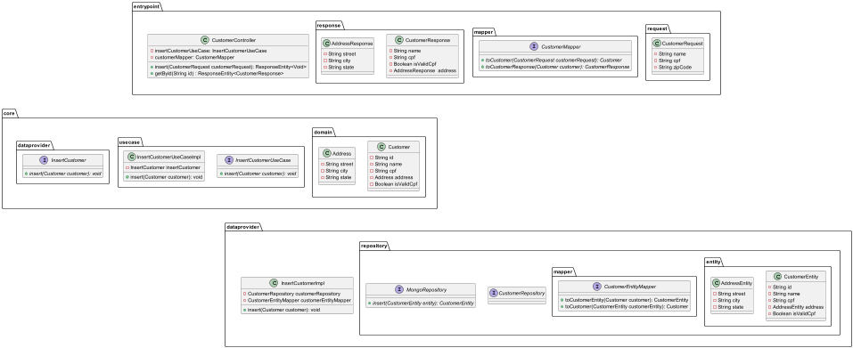

# cleanarch

## Objetivo

O Objetivo deste projeto é mostrar uma implementação da Clean Architecture em Java

## Diagrama de pacotes

A implementação da Clean Archtecture segue o seguinte diagrama.



## Libraries/Softwares

São necessárias bibliotecas e softwares externas a este projeto, a fim de execuá-lo, a saber:

[WireMock](https://wiremock.org/docs/download-and-installation/)

## Dependências

'O gerenciador de dependências usado é o Maven, consulte o pom.xml para saber as dependências e versões utilizadas.

## Mock da API de endereços
O projeto simula a conexão a uma API de busca de endereço, no momento da inserção do cliente, e para tal é usado a biblioteca [WireMock]().

Para criar uma massa de dados, criei dois arquivos JSON para cada endereço de teste e que estão disponíveis no diretório mappings. Este diretório segue a mesma nomenclatura que o WireMock utiliza e seu conteúdo é copiado para dentro do container do WireMock sempre que a aplicação é executada.

```json
{
    "request": {
        "method": "GET",
        "url": "/addresses/1234567"
    },
    "response": {
        "status": 200,
        "headers": {
            "Content-Type": "application/json"
        },
        "jsonBody": {
            "street": "Rua do Casino",
            "city": "São Paulo",
            "state": "São Paulo"
        }
    }
}
```

## Rodando o projeto via docker
### Images
O projeto utiliza uma imagem do [MongoDB](https://mongodb.com/) como base de dados e uma imagem do OpenJDK Alpine.

Para subir as imagens, execute o comando:
```
docker compose up -d --build
```

A aplicação está preparada para rodar na porta 5000 e tem três rotas disponíveis POST para inserir e duas GET onde uma é para buscar um Customer pelo ID e outra para buscar todos.

Buscar todos os Customers:
```
http://localhost:5000/customers/
```

Para inserir um Customer, utilize o seguinte payload abaixo no Postman.
```json
{
    "name": "Nome fictício",
    "zipCode": "1234567",
    "cpf": "11111111111"
}
```